# 🍫 Chocolatey E-Commerce Website

A full-stack chocolate e-commerce platform built with React.js frontend and Node.js backend, featuring user authentication, product management, shopping cart, order processing, and PayPal payment(sandbox) integration.

## 🌐 Live Demo

- **Website**: https://chocolatey.raspberryip.com/

## 📸 Screenshots


<details>
<summary><b>✨ Visual Tour | Screenshots</b></summary>

### 🏠 Homepage

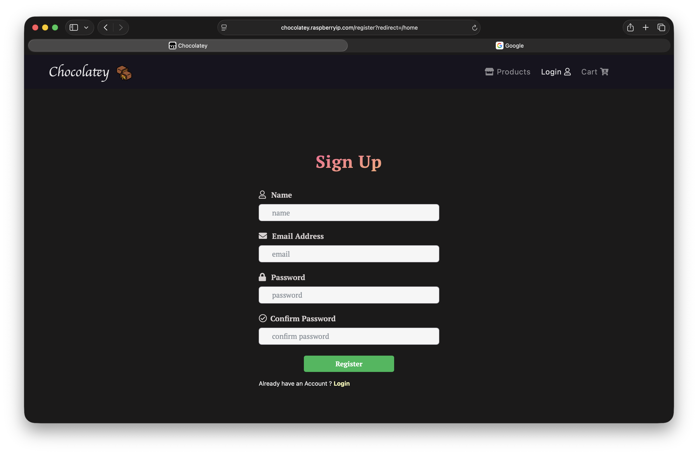


### 🛍️ Product Catalog


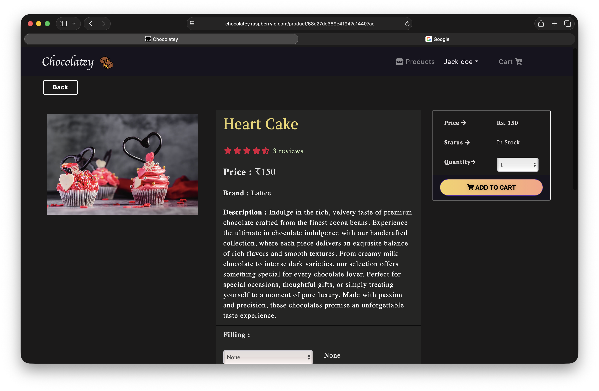

### ⚙️ Admin Dashboard

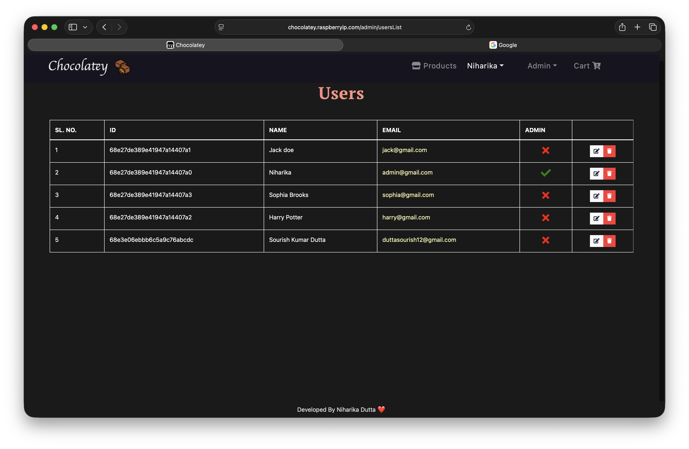
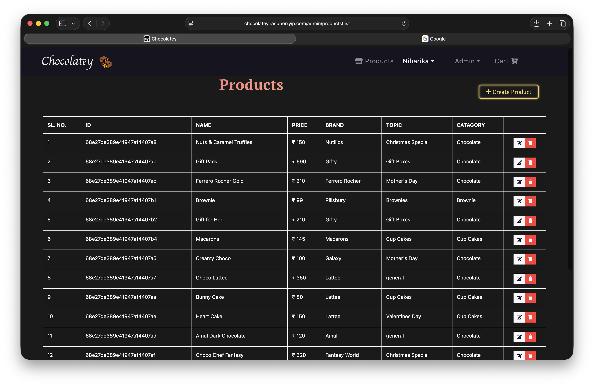
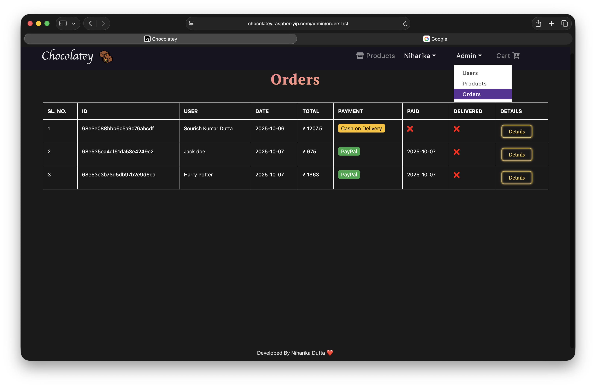

### 🛒 Shopping Cart and Checkout

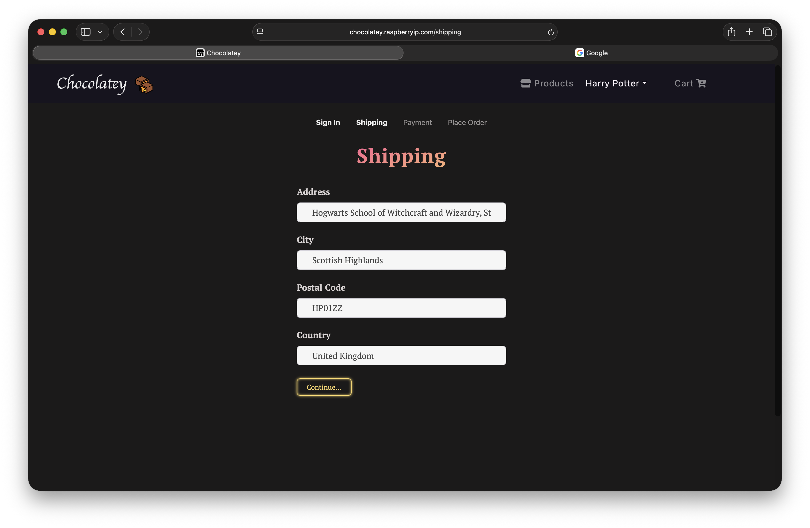
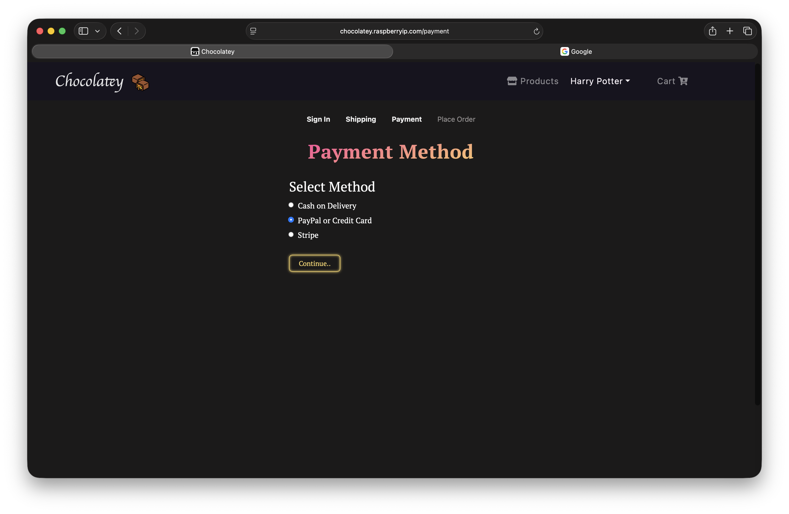
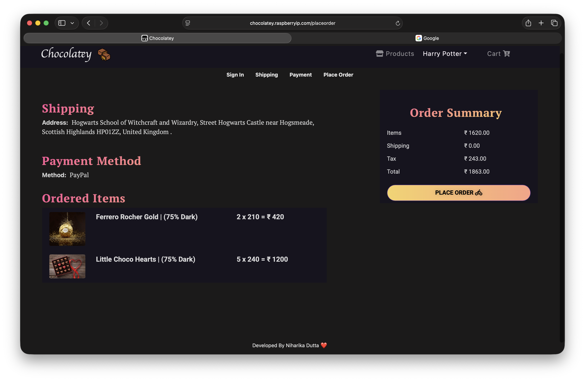
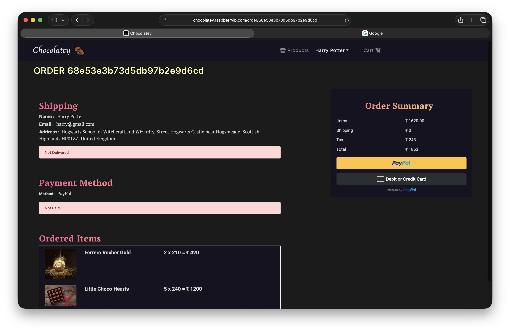
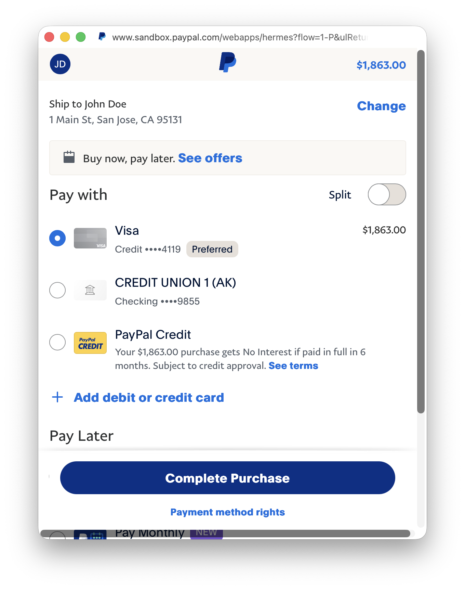
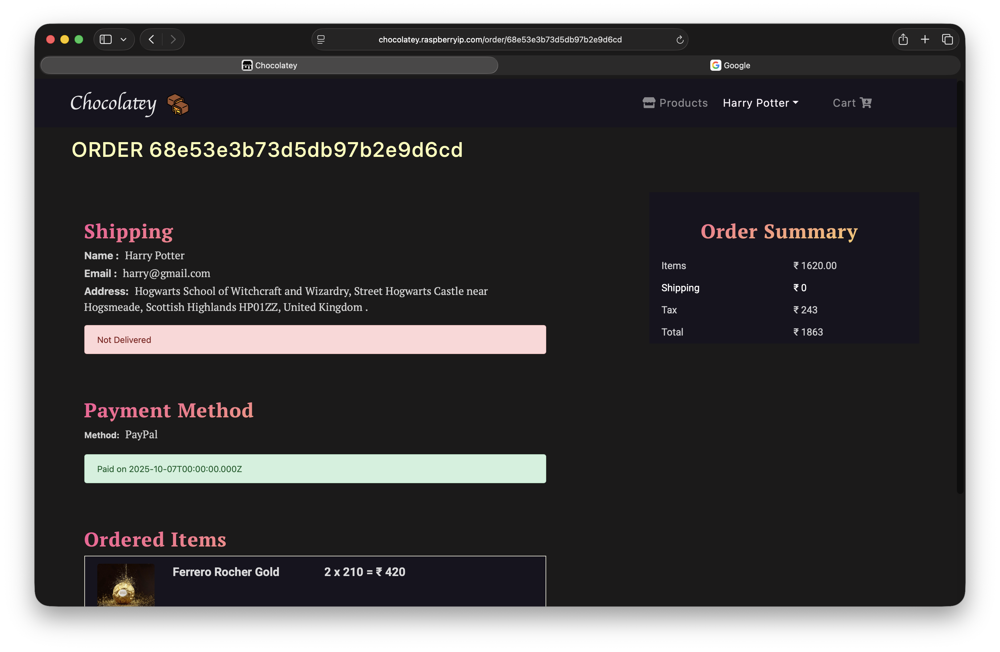

### ⭐ Customer Reviews and Ratings

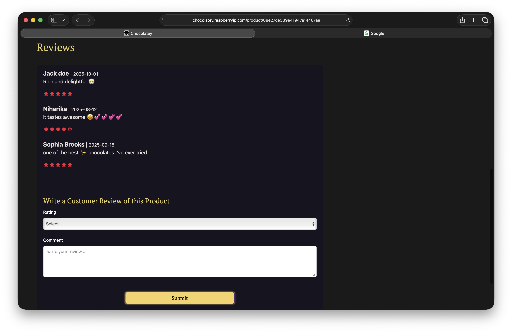

</details>

### Homepage

## 🌟 Features

**Customer**: Product catalog, user authentication, shopping cart, order management, PayPal payments, order tracking, user profiles.

**Admin**: Product management, user management, order management, admin dashboard.

## 🛠️ Tech Stack

🖥️ **<span style="color:rgb(66, 220, 231)">**Frontend**</span>**: React.js, Redux, React Router, Bootstrap, Axios, SCSS, CRACO.

⚙️ **<span style="color:rgb(38, 231, 112)">**Backend**</span>**: Node.js, Express.js, MongoDB, Mongoose, JWT, bcryptjs, Multer, PayPal SDK.

🐳 **<span style="color: #f6ad55">**DevOps**</span>**: Docker,MongoDB Atlas, Multi-platform builds(Linux AMD64/ARM64 support).

## 🚀 Getting Started

### Prerequisites

- Node.js (v14 or higher)
- MongoDB Atlas account or local MongoDB
- PayPal Developer account (for payments via sandbox)

### Installation

1. **Clone the repository**

   ```bash
   git clone https://github.com/yourusername/Chocolatey-Ecommerce-Website.git
   cd Chocolatey-Ecommerce-Website
   ```

2. **Install backend dependencies**

   ```bash
   cd backend
   npm install
   ```

3. **Install frontend dependencies**

   ```bash
   cd ../frontend
   npm install
   ```

4. **Environment Setup**

   Create a `.env` file in the backend directory:

   ```env
   PORT=5050
   NODE_ENV=development
   MONGODB_URI=your_mongodb_connection_string
   JWT_TOKEN=your_jwt_secret
   PAYPAL_CLIENT_ID=your_paypal_client_id
   PAYPAL_SECRET_ID=your_paypal_secret_id
   ```

   Create a `.env` file in the frontend directory:

   ```env
   REACT_APP_API_URL=http://localhost:5050
   ```

5. **Database Setup**
   ```bash
   cd backend
   npm run data:import  # Import sample data
   ```

**Note**: Make sure to set `isAdmin: true` in MongoDB for admin users.

### Running the Application

#### Development Mode

```bash
# Run both frontend and backend concurrently
cd backend
npm run dev
```

#### Individual Services

```bash
# Backend only
cd backend
npm start

# Frontend only
cd frontend
npm start
```

The application will be available at:

- Backend: http://localhost:5050
- Frontend: http://localhost:3000

## 🐳 Docker Deployment

### Build and Deploy with Docker

1. **Build the application**

   ```bash
   ./script.sh
   ```

2. **Deploy with Docker Compose**
   ```bash
   cd deployment
   docker compose up -d
   ```

### Manual Docker Commands

```bash
# Build image
docker build -t chocolatey-backend:v0.0.1 .

# Run container
docker run -p 5050:5050 --name chocolatey-backend --env-file .env chocolatey-backend:v0.0.1
```

## 🔧 Available Scripts

### Backend Scripts

- `npm start` - Start production server
- `npm run server` - Start development server with nodemon
- `npm run dev` - Start both frontend and backend
- `npm run data:import` - Import sample data to database
- `npm run data:destroy` - Clear database

### Frontend Scripts

- `npm start` - Start development server
- `npm run build` - Build for production
- `npm test` - Run tests

## 👨‍💻 Author

**Niharika Dutta**

- [GitHub](https://github.com/niharikadutta)
- [LinkedIn](https://www.linkedin.com/in/niharika2k00/)

⭐ If you found this project helpful, please give it a star!
